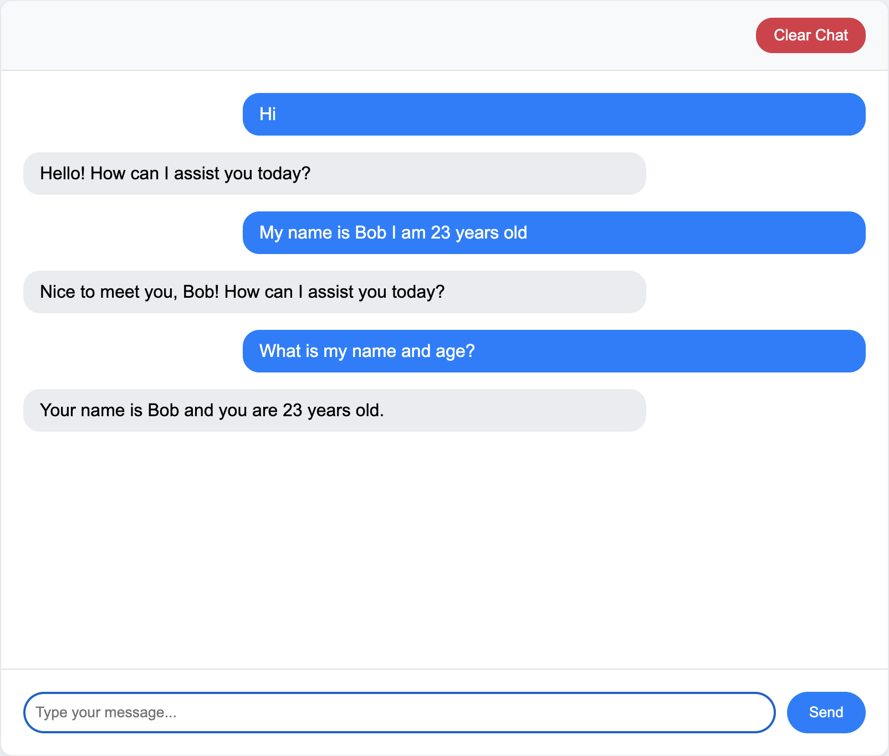
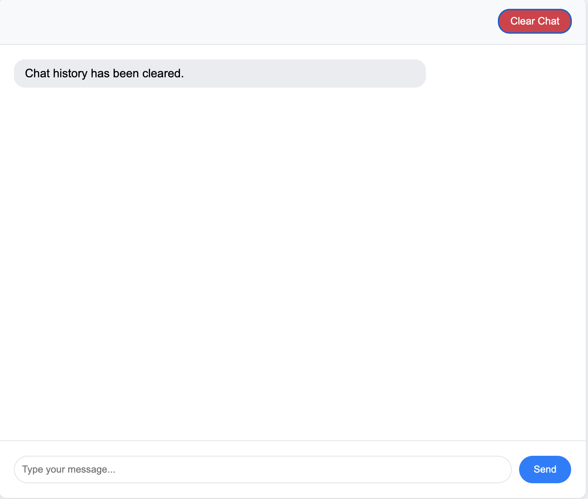

# AI Assistant Demo

A Flask-based AI chat assistant powered by OpenAI's GPT-4 that maintains conversation history and provides contextual responses.

## Features

- 👋 Friendly conversational interface
- 💾 Persistent conversation history
- 🔄 Contextual responses using GPT-4
- 🧹 Clear chat functionality
- 💬 Natural language processing
- 📡 RESTful API endpoints
- 🔒 CORS support

## Demo Screenshots

### Chat Interface

*Initial conversation with the AI assistant showing user information storage*

### Clear Chat Feature

*Demonstration of the chat clearing functionality*

## Technical Implementation

### Backend Architecture

The application is built using Flask and integrates with OpenAI's GPT-4 model. Here are the key components:

- **Framework**: Flask
- **AI Model**: OpenAI GPT-4
- **Data Storage**: JSON file-based conversation history
- **Cross-Origin Support**: Flask-CORS

### Dependencies

```plaintext
flask
flask-cors
openai
```

### API Endpoints

1. **GET /** 
   - Serves the main chat interface
   - Returns: HTML template

2. **POST /chat**
   - Handles chat messages
   - Request body: `{"message": "user message"}`
   - Returns: `{"response": "AI response"}`

3. **POST /clear**
   - Clears conversation history
   - Returns: `{"status": "History cleared"}`

### Code Structure

```python
# Key Components
├── app.py                    # Main Flask application
├── templates/               
│   └── index.html           # Chat interface template
└── conversation_history.json # Persistent storage
```

### Core Functionality

1. **Conversation History Management**
```python
def load_history():
    """Load conversation history from a JSON file."""
    if os.path.exists(HISTORY_FILE):
        with open(HISTORY_FILE, 'r') as f:
            return json.load(f)
    return [{'role': 'system', 'content': 'You are a helpful assistant.'}]

def save_history(history):
    """Save conversation history to a JSON file."""
    with open(HISTORY_FILE, 'w') as f:
        json.dump(history, f, indent=4)
```

2. **Chat Processing**
```python
@app.route('/chat', methods=['POST'])
def chat():
    data = request.json
    user_message = data.get('message', '')
    history = load_history()
    history.append({'role': 'user', 'content': user_message})
    
    # OpenAI API integration
    response = client.chat.completions.create(
        model='gpt-4',
        messages=history
    )
    
    ai_response = response.choices[0].message.content
    history.append({'role': 'assistant', 'content': ai_response})
    save_history(history)
    
    return jsonify({'response': ai_response})
```

## Installation and Setup

1. Clone the repository
```bash
git clone [repository-url]
cd ai-assistant
```

2. Install dependencies
```bash
pip install flask flask-cors openai
```

3. Set up OpenAI API key
```python
# In app.py
OPENAI_API_KEY = 'your-api-key-here'
```

4. Run the application
```bash
python app.py
```

## Usage

1. Start the Flask server
2. Open your browser and navigate to `http://localhost:5000`
3. Start chatting with the AI assistant
4. Use the 'Clear Chat' button to reset the conversation history

## Security Considerations

1. The OpenAI API key should be stored as an environment variable, not directly in the code
2. Implementation of user authentication is recommended for production
3. Regular cleanup of conversation history may be needed
4. CORS settings should be configured appropriately for production

## Contributing

1. Fork the repository
2. Create a feature branch
3. Commit your changes
4. Push to the branch
5. Create a Pull Request


## Acknowledgments

- OpenAI for providing the GPT-4 API
- Flask framework community
- [Add other acknowledgments]